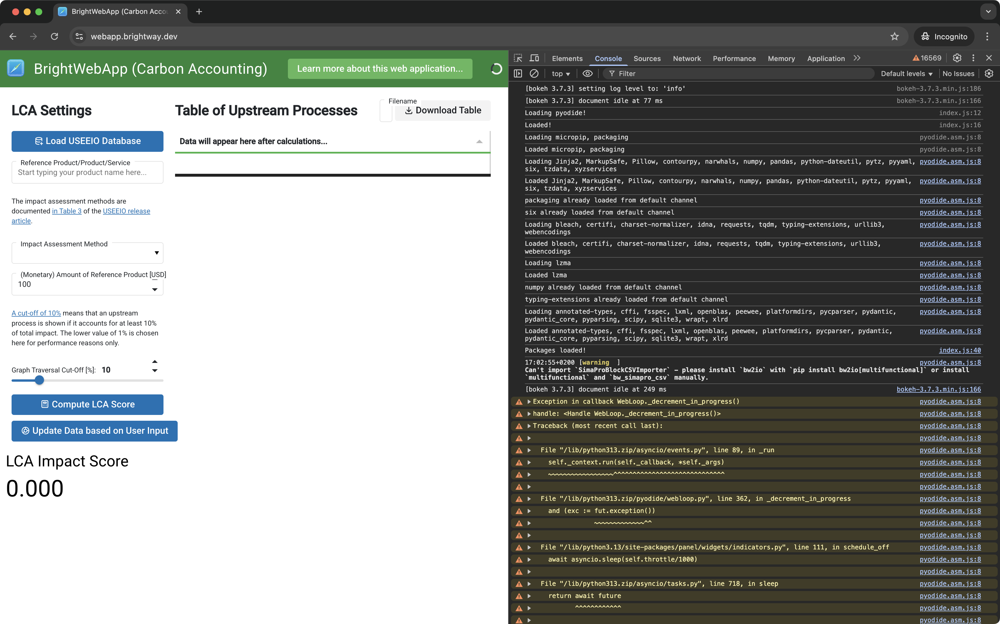

# FAQ

## Why does [the webapp](http://webapp.brightway.dev) load slowly?

Brightway requires _many, many_ dependencies. The total file size of all packages sums up to ~90MB. You can use your browser's developer tools ("Network" tab) to check the size of the packages that are loaded when you open the webapp. Here is a short excerpt of the packages that are loaded when you open the webapp:

| Package         | Size (MB) |
| :-------------- | :-------- |
| bw2io           | 27.654    |
| scipy           | 13.215    |
| plotly          | 9.642     |
| pandas          | 5.616     |
| randonneur_data | 5.401     |
| numpy           | 2.565     |

Depending on your internet connection, it can therefore take a while to download all these packages. Also, [note that](https://pyodide.org/en/stable/project/roadmap.html#improve-performance-of-python-code-in-pyodide):

> Across benchmarks Pyodide is currently around 3x to 5x slower than native Python.

## How can I check if there are any errors in the webapp?

You can use your browser's developer tools ("Console" tab) to see if there are any errors in the webapp. Any Python and WebAssembly errors that occur in the webapp will be printed to the console. 

