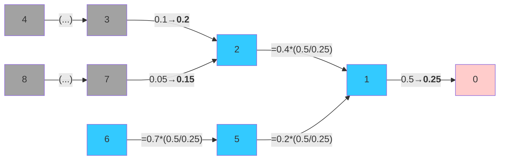

# BrightWebApp

[:simple-webassembly: Open Browser-based interactive WebAssembly Application (may load slowly) ](https://webapp.brightway.dev){ .md-button }

`BrightWebApp` is a Python package designed to showcase how [the Brightway software framework](https://docs.brightway.dev/en/latest/) can be adapted to provide complex life-cycle assessment calculations in the context of web applications. It is designed to be used either through a [Pyodide](https://pyodide.org/en/stable/) ([WebAssembly](https://www.google.com/search?client=safari&rls=en&q=webassembly&ie=UTF-8&oe=UTF-8)) enabled [Panel](https://panel.holoviz.org) dashboard, or by accessing it running in a Docker container.

**Illustration of a supply chain graph, as it would appear in the context of life-cycle assessment**.

As a use-case, it implements a simple logic for modifying branches of a supply chain based user input. This allows practitioners to modify either the amount of flow between production processes or the environmental burden intensity of individual processes.