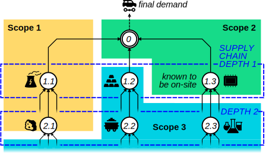

# BrightWebApp

`BrightWebApp` is a Python package designed to showcase how [the Brightway software framework](https://docs.brightway.dev/en/latest/) can be adapted to provide complex life-cycle assessment calculations in the context of web applications. It is designed to be used either through a [Pyodide](https://pyodide.org/en/stable/) ([WebAssembly](https://www.google.com/search?client=safari&rls=en&q=webassembly&ie=UTF-8&oe=UTF-8)) enabled [Panel](https://panel.holoviz.org) dashboard, or by accessing it running in a Docker container.

    

**Diagram of the example use-case implemented in the `BrightWebApp` package.** _Here, every numbered circle represents a production node in the supply chain graph of automotive manufacturing. The supply chain can be split into different levels of "depth". Every node can be assigned to one of three "emission scopes", as defined by the Greenhouse Gas Protocol accounting standard:_ 

> **Scope 1: Direct GHG emissions.** These are from sources that are owned or controlled by the company, for example, emissions from combustion in owned or controlled boilers, furnaces, vehicles, etc.  
> **Scope 2: Electricity indirect GHG emissions.** These are from the generation of purchased electricity consumed by the company. Scope 2 emissions physically occur at the facility where electricity is generated.  
> **Scope 3: Other indirect GHG emissions.** All other indirect emissions.

[Adapted from chapter 4, P.25 in "The Greenhouse Gas Protocol, A Corporate Accounting and Reporting Standard" (Revised Edition, 2004)](https://ghgprotocol.org/sites/default/files/standards/ghg-protocol-revised.pdf)