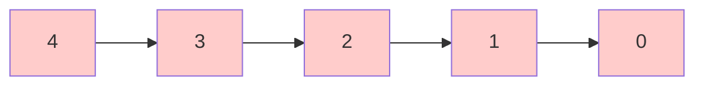
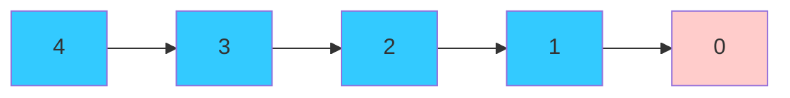
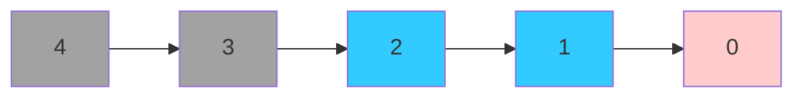

# Supply Chain Modifications

    

**Diagram of the supply chain modification logic implemented in the `BrightWebApp` package.** Here, the flow between processes is described only in monetary terms. A simple supply chain of 5 processes is shown as an example:

As the diagram shows, each process provides a certain amount of monetary input to the next process. Each process also generates a certain amount of value added (profits, etc.). In this example, we assume that data is derived from an [input-output table](https://en.wikipedia.org/wiki/Input–output_model) and therefore represents sectoral averages.

In this example, we now know that process 0 requires less input from process 1 than the sectoral average. This means that less input is requires also of all processes upstream of process 1:

In this example, we also know that process 2 requires more input from process 3 than the sectoral average. This means that more input is required also of all processes downstream of process 3:

!!! warning
    Note that this logic puts a significant amount of power in the hands of the practitioner. Even the present diagram shows this: In the case of only monetary inputs, modifying the flow amount between processes can lead to "uneconomical" situations where processes take in more value than they generate. A more sophisticated approach would be to use a more complex model of the supply chain, such as a [general equilibrium model](https://en.wikipedia.org/wiki/General_equilibrium_model) or a [computable general equilibrium model](https://en.wikipedia.org/wiki/Computable_general_equilibrium_model). This, however is beyond the scope of this package.